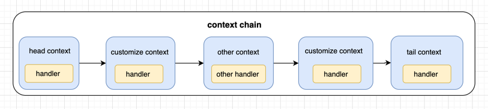
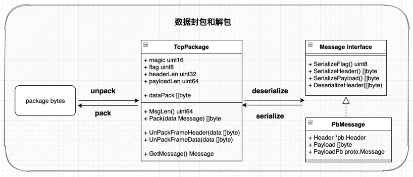

# camellia
<!--  -->


### 一、项目结构

```plain
./camellia
├── client
├── config          //configs
├── core
│    ├── channel    //context chain
│    ├── datapack   //数据包处理
│    └── format
├── protocol        //pb文件
├── pb_generate
├── server
├── static
│     └── images
├── main.go
├── LICENSE
├── Makefile
├── README.md
├── go.mod
└── go.sum
```
### 二、Quick Start
1. 生成pb代码
```shell
- linux/macos
protocol/gen.sh # 需要首先下载安装protoc，加入可执行目录

- windows
protocol/protoc.exe
```
2. 生成连接的认证密钥
```shell
- 修改密钥文件生成目录
# core/util/secret_gen.go
var secretPath = "/path/to/secret/" #替换成正式的目录

- 运行生成代码
# core/util/secret_gen_test.go
TestGenKey()
```

3. 启动server
```shell
go run main.go #or CGO_ENABLED=0 go run main.go
```
4. 启动client
```shell
go run client/golang/client.go #or CGO_ENABLED=0 go run client/golang/client.go
```

5. 修改配置文件(可选)
```yaml
# 配置文件目录: resources/
# 默认配置文件：resources/config.yml
# web.port: tcp端口，默认9090
# log.debug:为true时输出console日志，日志level为debug

# 可选择增加带环境变量的配置文件,eg:config-test.yml
# 增加环境变量profiles,增加test环境,eg:profiles=test
```

6. 拓展自定义消息处理逻辑
```shell
# core/channel/channel_handler.go

# 新增HandlerFunc函数
# 函数参数：
# 1. ctx *ConnContext连接上下文，包含连接状态、写出数据chan等
# 2. msg datapack.Message消息数据，包括解析后的header，以及 []byte 的payload
```
```go
func ExampleHandlerFunc(ctx *ConnContext, msg datapack.Message) {
	header := msg.GetHeader()
	msgType := header.MsgType
	
	// ...其他代码
}

//添加HandlerFunc到context chain中
// server/server.go
// func dealConn(conn *net.Conn) {...}
c.Ctx.InitHandlerContext(channel.AuthHandlerFunc, channel.ExampleHandlerFunc, channel.DispatchHandlerFunc)
```
```shell
# HandlerFunc包含在HandlerContext中，自动向下传递
# 如果需要中断传递，可以在当前的HandlerFunc中加入代码: 
# ctx.Abort = true
# 此时会跳过后续非Tail的其他handlerFunc
```

### 三、数据包定义

```javascript
                                      Fixed Header (15 bytes)                                             Actual Content
            +-----------+--------------------------+-------------+--------------+      +-----------------------+-------------------------------+
byte offset |     2     |            3             |      7      |      15      |      |    15 + headerLen     |  15 + headerLen + payloadLen  |
field/bytes |  magic 2  |          flag 1          | headerLen 4 | payloadLen 8 |----->|    Variable Header    |             Payload           |
content     |   0xC0C0  |  version+serialize flag  |     uint32  |   uint64     |      |   msgType,userInfo... |         "HELLO, WORLD"        |
            +-----------+--------------------------+-------------+--------------+      +-----------------------+-------------------------------+
```

### 四、context和handler
- context包装handler构成chain链表的一个node
- 每个context包含pre context和next context的引用
- 固定有一个HeadContext和一个TailContext
- 自定义handler加入chain拓展业务逻辑处理
- 目前只有单向从head流向tail


```go
//ConnContext 
type ConnContext struct {
	isInit   bool
	initLock sync.Mutex

	WriteChan  chan<- []byte

	//handler chain
	Head, Tail HandlerContext
}

//HandlerContext wrap handlers as linklist node
type HandlerContext struct {
	Handler   func (ctx *ConnContext, msg datapack.Message)
	pre, next *HandlerContext
}

```

### 五、数据包处理
