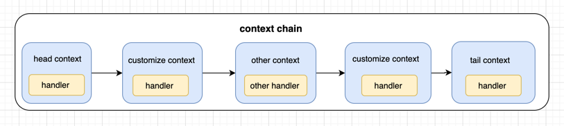
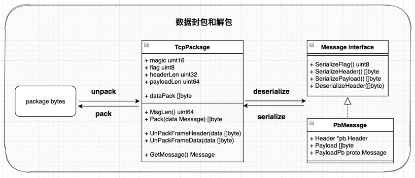

# camellia
<!--  -->


### 一、项目结构

```json
./camellia
├── client
├── config            //configs
├── core
│    ├── channel      //context chain
│    ├── datapack     //数据包处理
│    └── format
├── protocol          //pb文件
├── pb_generate
├── server
├── static
│     └── images
├── main.go
├── LICENSE
├── Makefile
├── README.md
├── go.mod
└── go.sum
```


### 二、数据包定义

```javascript
                                      Fixed Header (15 bytes)                                             Actual Content
                +-----------+--------------------------+--------------+---------------+      +-----------------------+----------------+
byte offset     |     2     |            3             |      7       |       15      |      |      header len       |   payload len  |
field and bytes |  magic 2  |          flag 1          | header len 4 | payload len 8 |----->|   Variable Header     |     Payload    |
content         |   0xC0C0  |  version+serialize flag  |     uint32   |   uint64      |      |  msgType,userInfo...  | "HELLO, WORLD" |
                +-----------+--------------------------+--------------+---------------+      +-----------------------+----------------+
```

### 三、context和handler
- context包装handler构成chain链表的一个node
- 每个context包含pre context和next context的引用
- 固定有一个HeadContext和一个TailContext
- 自定义handler加入chain拓展业务逻辑处理
- 目前只有单向从head流向tail


```go
//ConnContext 
type ConnContext struct {
	isInit   bool
	initLock sync.Mutex

	WriteChan  chan<- []byte

	//handler chain
	Head, Tail HandlerContext
}

//HandlerContext wrap handlers as linklist node
type HandlerContext struct {
	handler   DataHandler
	pre, next *HandlerContext
}

```

### 四、数据包处理
